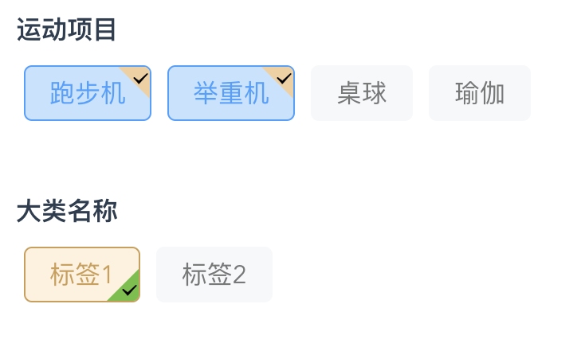

# filter-item

- 筛选组件
- Vue2

# Intall

`npm install filter-item`

# Usage

## 全局引入

main.js

```
import Vue from 'vue'
import App from './App.vue'
import filterItem from 'filter-item'
import 'filter-item/filter-item.css'

Vue.config.productionTip = false
Vue.use(filterItem)

new Vue({
  render: h => h(App),
}).$mount('#app')

```

vue 页面使用

```
<filter-item :defaultTags="[1]" :radio="false"></filter-item>
```

## 传参说明

| 传参名称    | 参数类型 | 默认值                                                       | 说明                                                         |
| ----------- | -------- | ------------------------------------------------------------ | ------------------------------------------------------------ |
| className   | String   | 大类名称                                                     | 大类名称                                                     |
| defaultTags | Array    | []                                                           | 默认选中的表标签 key 值存储数组                              |
| tagList     | Array    | [{name:'标签 1',key:1},{name:'标签 2',key:2}]                | 标签项                                                       |
| radio       | Boolean  | false                                                        | 是否单选                                                     |
| iconStyle   | Object   | {<br />  size:16,<br />  name:'#icon-dagou1',<br />  angle:'0deg',<br />  position:'bottomLeft',<br />  markColor:'#67C23A'<br />} | 打勾标识样式 <br />size:Number<br />name:String（Symbol导出的iconfont图标名称）<br />angel:String<br />position:String<br />枚举：['topLeft','topRight','bottomLeft','bottomRight']<br />markColor:String |
| checkStyle  | Object   | {<br />border:'#cd9f54',<br />backgroundColor:'#fff2de',<br />color:'#cd9f54'<br />} | 打标签样式                                                   |

## 页面例子

